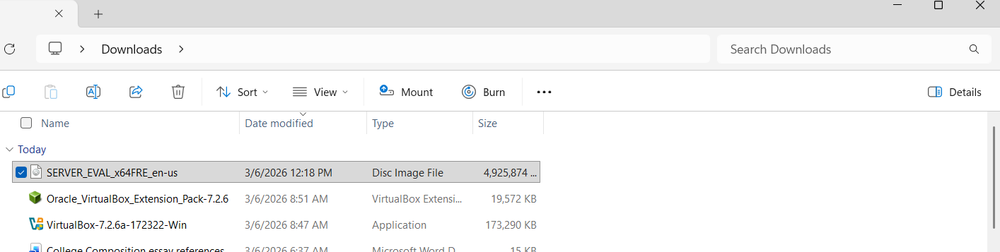
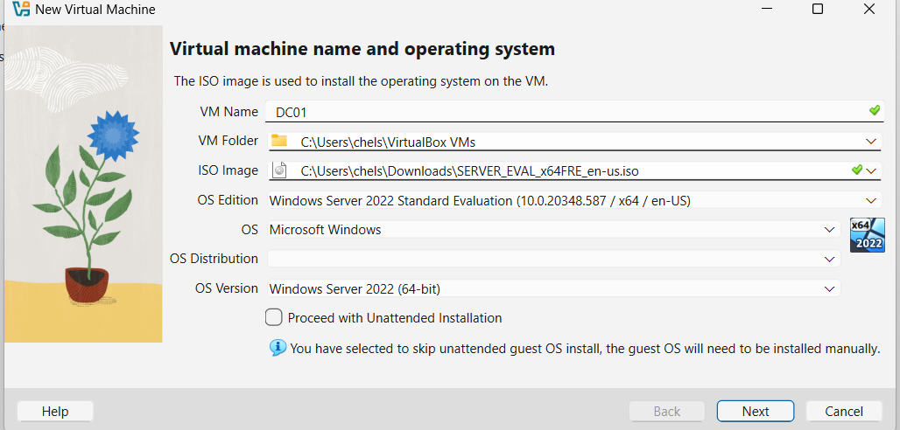
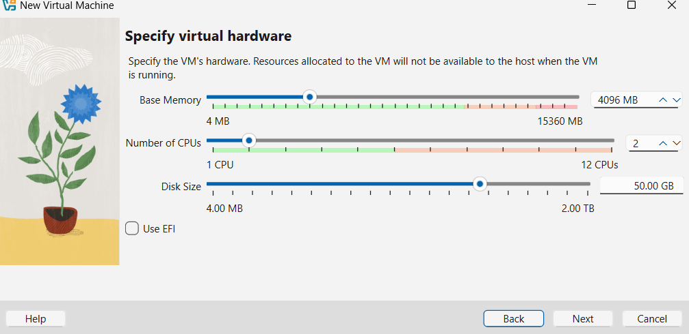
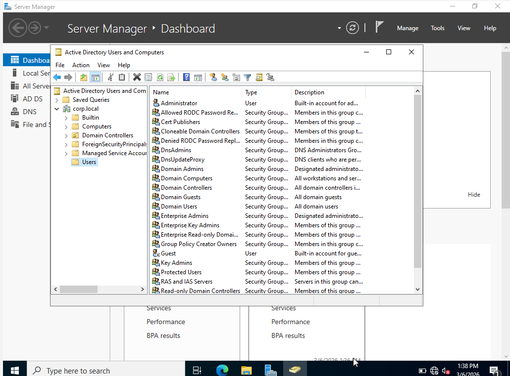
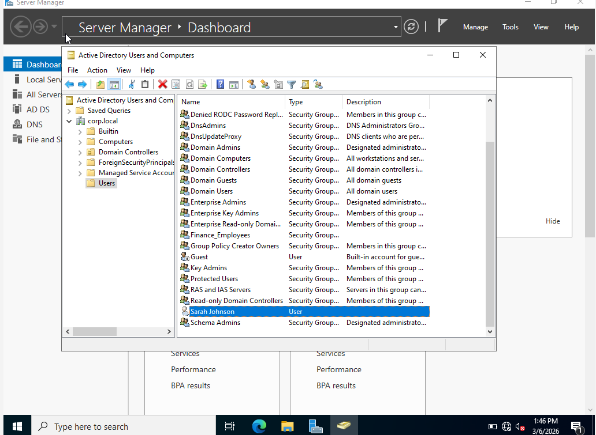
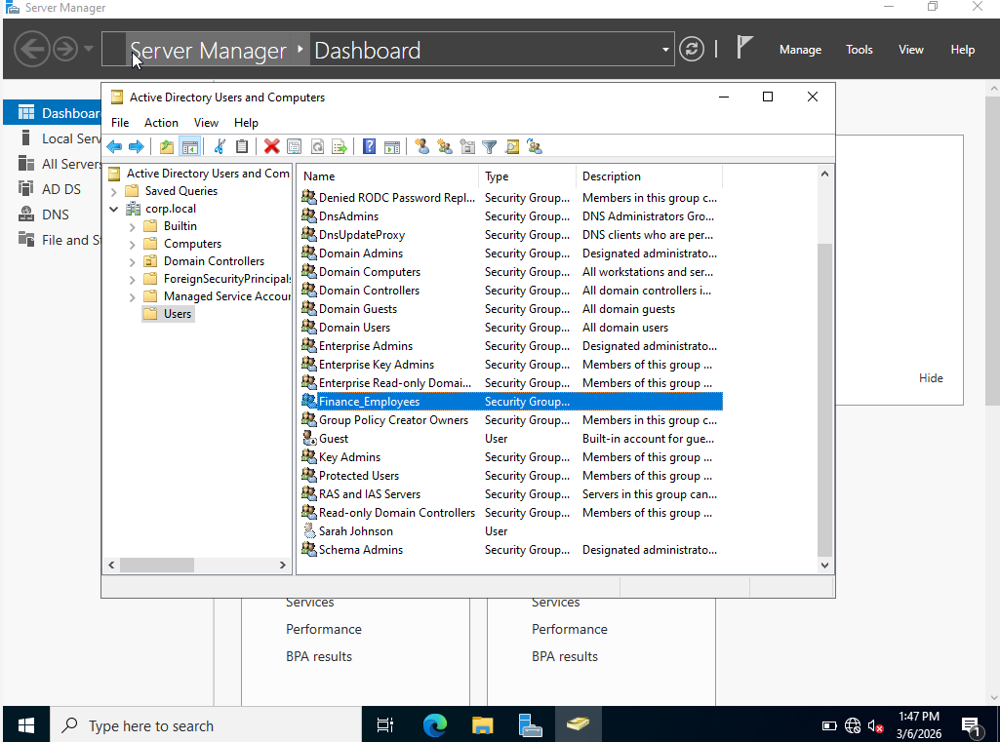
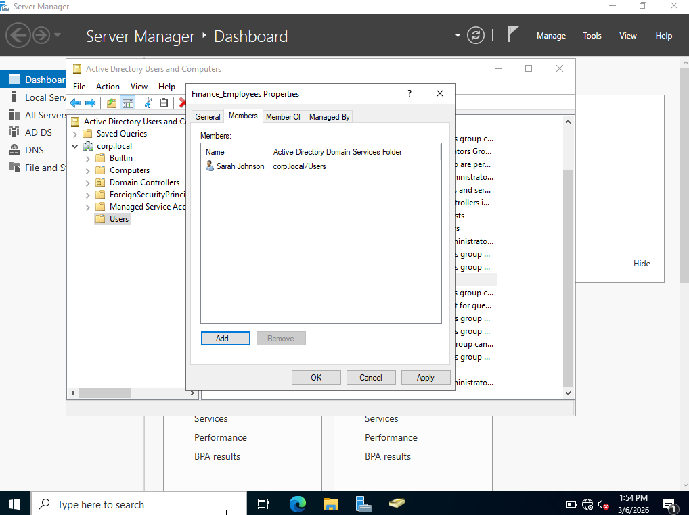
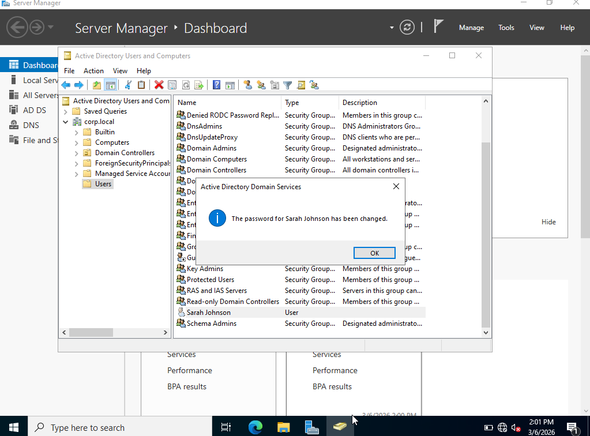

 IAM Active Directory Lab

This project demonstrates Identity and Access Management (IAM) tasks using Active Directory in Windows Server 2022.
This lab simulates common Identity and Access Management (IAM) tasks performed by system administrators and IAM analysts. The environment was built using a virtual machine running Windows Server 2022 with Active Directory Domain Services installed.

The lab demonstrates the following IAM operations:

- Creating user identities
- Managing security groups
- Assigning group membership
- Resetting user passwords
- Administering Active Directory objects

##Lab Environment

• Oracle VirtualBox
• Windows Server 2022
• Active Directory Domain Services

Step 1: Open Oracle VirtualBox

Step 2: Install Windows Server ISO

Step 3: Build the Server

Step 4: Configure Virtual Machine Hardware

Step 5: Virtual Machine Created

Step 6: Active Directory Domain Users Console

Step 7: Create Active Directory User

 Step 8: Create Security Group

Step 9: Add User To Group

Step 10: Reset User Password

##Skills Demonstrated

• Active Directory administration
• User account creation
• Security group management
• Group membership assignment
• Password reset procedures
• Identity and Access Management fundamentals

 
